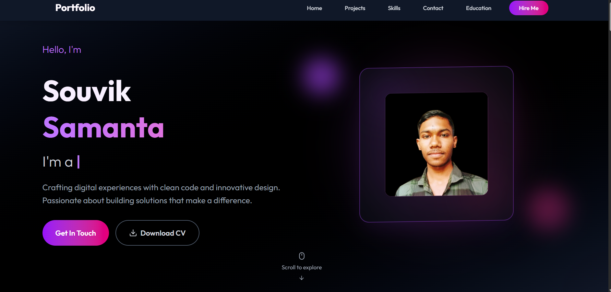

<!-- Banner -->
<p align="center">
  
</p>

<h1 align="center">🌟 Souvik Portfolio</h1>

<p align="center">
  <em>A modern, elegant, and fully responsive personal portfolio built with React, Tailwind CSS, and Framer Motion.</em>
</p>

<p align="center">
  <a href="https://github.com/souvikssamanta/Portfollio/stargazers">
    
  </a>
  <a href="https://github.com/souvikssamanta/Portfollio/network/members">
    
  </a>
  <a href="https://github.com/souvikssamanta/Portfollio/issues">
    
  </a>
  <a href="https://github.com/souvikssamanta/Portfollio/blob/main/LICENSE">
    
  </a>
</p>

---

## 🚀 About the Project

This portfolio showcases my work as a **Frontend Developer**, highlighting my projects, skills, and achievements.  
It’s designed with attention to detail, smooth animations, and a responsive layout to deliver a beautiful and engaging user experience.

🎯 **Live Demo:** [https://portfollio-nzya.onrender.com]

---

## ⚙️ Tech Stack

| Category | Technologies |
|-----------|--------------|
| 💻 Frontend | React.js |
| 🎨 Styling | Tailwind CSS |
| ✨ Animations | Framer Motion |
| 📧 Contact Form | EmailJS |

---

## 🌈 Features

- ⚡ Fully responsive modern design  
- 🎥 Smooth transitions and Framer Motion animations  
- 🧩 Reusable React components for easy scalability  
- 📬 Functional contact form powered by EmailJS  
- 🖼️ Beautiful project showcase section  
- 🌙 Clean UI with Tailwind and minimal color palette  

---

## 🛠️ Installation & Setup

Run this project locally with ease 👇

```bash
# Clone the repository
git clone https://github.com/souvikssamanta/Portfollio.git

# Navigate to project directory
cd Portfollio

# Install dependencies
npm install
Portfolio/
│
├── public/
│   ├── assets/          # Images, icons, and static files
│   └── index.html       # Main HTML template
│
├── src/
│   ├── components/      # Reusable UI components
│   ├── pages/           # Pages (Home, About, Projects, Contact)
│   ├── styles/          # Tailwind/custom CSS
│   ├── App.jsx          # Root component
│   └── main.jsx         # Entry point
│
└── package.json

# Start development server
npm start

| Home Page                             | Projects Section                              | Contact Page                                |
| ------------------------------------- | --------------------------------------------- | ------------------------------------------- |
|  |  |  |

